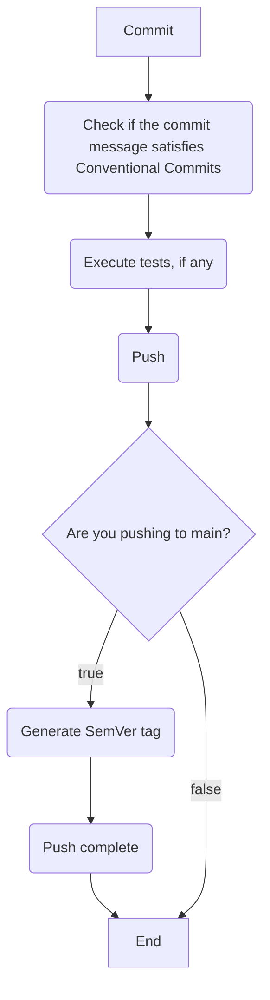

# Git Template
Template for my personal projects. Contains useful hooks for my workflows.

## Flow

### Notes
#### Why not GitHub Actions for your workflows?
TLDR: I hate them, I don't need them outside work and they are almost always overkill.
- They're very slow
- I don't need a container or a VM to run tests and tag a commit
- I want to do checks _before_ committing and pushing
